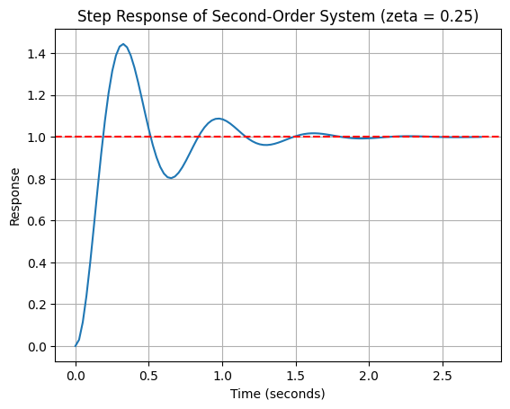
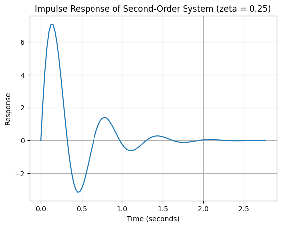
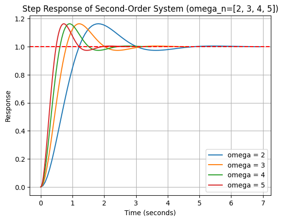

# Systém:

Systém je jakýkoli proces, objekt nebo uspořádání komponent, který přijímá vstup a přeměňuje jej na výstup prostřednictvím určité formy vnitřní dynamiky nebo operace. Systémy lze definovat v různých technických oblastech, ale i netechnických jako např. biologie, ekonomie a sociálních věd. Mohou být definovány přírozeně (například ekosystémy) nebo uměle definované (například mechanické, elektrické nebo regulační systémy).

V kontextu teorie řízení je systém obvykle definován jako:

- Soubor komponent nebo prvků, které mezi sebou interagují podle určitých pravidel nebo zákonů (relací).
- Systém přijímá jeden nebo více vstupů a produkuje jeden nebo více výstupů.
- Vnitřní dynamika zajišťuje, jak je vstup zpracován nebo přeměněn na výstup.

## Klasifikace systémů:

1. **Orientované vs. Neorientované systémy**:
   - **Orientované systémy**: Tyto systémy mají jasně definovaný směr interakce, často zahrnující vstupy a výstupy se specifickými rolemi. Například v řídicím systému je tok orientován od vstupu k výstupu (kauzální).
   - **Neorientované systémy**: Tyto systémy postrádají jasný směr interakce. Komponenty se navzájem ovlivňují bez konkrétního vztahu mezi vstupem a výstupem. Příkladem může být síť vzájemně propojených komponent, jako je elektrická rozvodná síť.

2. **Kauzální vs. Nekauzální systémy**:
   - **Kauzální systémy**: Výstup systému v jakémkoli čase závisí pouze na minulých a současných vstupech. Budoucí vstupy neovlivňují aktuální výstup. Většina fyzikálních systémů je kauzální.
     - Příklad: V běžném elektrickém obvodu závisí výstupní napětí v určitém čase pouze na současných nebo minulých vstupech.
   - **Nekauzální systémy**: Tyto systémy mají výstupy, které závisí na budoucích vstupech. Nekauzální systémy jsou obvykle teoretické nebo matematické a nemohou existovat v reálných systémech, protože by vyžadovaly znalost budoucích vstupů.
     - Příklad: Předpovídání budoucnosti.

3. **Deterministické vs. Stochastické systémy**:
   - **Deterministické systémy**: Chování systému je zcela předvídatelné a je určeno počátečními podmínkami a vstupy systému. Neexistuje zde žádná náhodnost.
     - Příklad: Pohyb kyvadla ve vakuu, kde jeho budoucí poloha je zcela určena jeho počáteční polohou a rychlostí.
   - **Stochastické systémy**: Chování systému zahrnuje určitou míru náhody nebo nejistoty. I když jsou počáteční podmínky a vstupy známy, přesný výstup nelze s jistotou předpovědět.
     - Příklad: Ceny na akciovém trhu nebo vývoj počasí. Tyto vývoje jsou ovlivněny náhodnými nebo pravděpodobnostními událostmi.

4. **Dynamické vs. Statické systémy**:
   - **Dynamické systémy**: Výstup systému závisí na čase a jeho minulém chování (paměť). Dynamické systémy jsou popsány diferenciálními nebo diferenčními rovnicemi a jejich výstup se vyvíjí v čase.
     - Příklad: Systém tlumení kol auta, který reaguje na nerovnosti na silnici postupně v čase.
   - **Statické systémy**: Výstup systému závisí pouze na aktuálním vstupu a ne na minulých vstupech nebo stavech (nemají paměť). Tyto systémy nemají vnitřní dynamiku a často jsou modelovány algebraickými rovnicemi.
     - Příklad: Jednoduchý rezistor, kde napětí na něm je v každém okamžiku úměrné proudu, aniž by bralo v úvahu předchozí proudy.

## Vnější popis systému

V teorii řízení a teorii systémů lze systém popsat externě několika způsoby. Tyto popisy zachycují, jak systém reaguje na vnější vstupy, a používají se k modelování a analýze chování systému. Některé způsoby vnějšího popisu jsou:

1. **Diferenciální rovnice**:
   - **Diferenciální rovnice** popisuje vztah mezi vstupem a výstupem systému v časové doméně a také, jak se výstup vyvíjí v čase. Pro **dynamické systémy** je výstup vyjádřen jako funkce vstupu systému a jeho derivací.
   
   **Příklad**:
   Pro systém prvního řádu je diferenciální rovnice:
   
   $\tau \frac{dy(t)}{dt} + y(t) = K u(t)$
   
   Kde:
   - $y(t)$ je výstup.
   - $u(t)$ je vstup.
   - $\tau$ je časová konstanta.
   - $K$ je zesílení systému.

   Tento popis je běžně používán pro modelování mechanických, elektrických a tepelných systémů v časové doméně.

2. **Přenosová funkce (v Laplaceově transformaci)**:
   - **Přenosová funkce (Přenos)** je poměr výstupu ke vstupu systému, vyjádřený v **Laplaceově doméně**. Přenosová funkce poskytuje kompaktní způsob, jak reprezentovat chování systému převodem diferenciálních rovnic na algebraické rovnice pomocí Laplaceovy transformace.
   
   **Příklad**:
   Přenosová funkce pro systém prvního řádu je:
   
   $G(s) = \frac{Y(s)}{U(s)} = \frac{K}{\tau s + 1}$
   
   Kde:
   - $G(s)$ je přenosová funkce.
   - $Y(s)$ je Laplaceova transformace výstupu $y(t)$.
   - $U(s)$ je Laplaceova transformace vstupu $u(t)$.
   - $s$ je komplexní frekvenční proměnná v Laplaceově doméně.
   
   Přenosová funkce je zvláště užitečná pro analýzu frekvenční odezvy a stability systému.

5. **Přechodová funkce**:
   - **Přechodová funkce** popisuje chování systému v časové doméně při skokové změně vstupu (tj. vstup, který se náhle změní z nuly na pevnou hodnotu). **Přechodová funkce** ukazuje, jak se výstup systému vyvíjí z počátečního stavu do ustáleného stavu po náhlé změně vstupu.
   
   **Příklad**:
   Pro systém prvního řádu s přenosovou funkcí $G(s) = \frac{K}{\tau s + 1}$ je přechodová funkce v časové doméně:
   
   $y(t) = K \left( 1 - e^{-t/\tau} \right)$
   
   Přechodová funkce poskytuje informace o době nárůstu, době ustálení a ustálené hodnotě systému.

6. **Přechodová charakteristika**:
   - **Přechodová charakteristika** odkazuje na specifické metriky odvozené z přechodové funkce, jako jsou:
     - **Doba náběhu**: Čas potřebný k nárůstu od 10 % do 90 % konečné hodnoty.
     - **Doba ustálení**: Čas, po který zůstává výstup v určitém procentu (např. 2 %) od konečné hodnoty.
     - **Překmit**: Velikost amplitudy, o kterou výstup přesáhne požadovanou konečnou hodnotu.
     - **Chyba ustáleného stavu**: Rozdíl mezi konečným výstupem a požadovaným výstupem v ustáleném stavu.

7. **Impulsní funkce**:
   - **Impulsní funkce** je výstup systému při vystavení Diracově delta funkci (impulsní vstup) v čase $t = 0$. Poskytuje přehled o tom, jak systém reaguje na velmi krátký a prudký vstup.
   
   **Příklad**:
   Pro systém prvního řádu je impulsní odezva derivací krokové odezvy:
   
   $h(t) = \frac{K}{\tau} e^{-t/\tau}, \quad t \geq 0$
   
   Impulsní odezva je zvláště užitečná pro analýzu přechodového chování systému a slouží jako základní prvek pro složitější vstupy prostřednictvím konvoluce.

9. **Impulsní charakteristika**:
   - **Impulsní charakteristika** poskytuje kompletní popis dynamiky systému. Vzhledem k tomu, že impulsní odezva reprezentuje reakci systému na velmi krátký vstup, může být použita k určení, jak systém reaguje na jakýkoli libovolný vstup prostřednictvím **konvoluce**.

## Systém prvního řádu

Typicky odkazuje na systém, který má přenosovou funkci ve tvaru:

$G(s) = \frac{K}{\tau s + 1}$

Kde:
- $G(s)$: je přenosová funkce systému.
- $K$: je zesílení systému. Reprezentuje poměr velikosti výstupu k velikosti vstupu v ustáleném stavu.
- $\tau$ (tau): je časová konstanta systému. Udává, jak rychle systém reaguje na změny. Menší časová konstanta znamená rychlejší odezvu systému.
- $s$: je Laplaceova proměnná (komplexní frekvence), což je standardní součást přenosových funkcí v Laplaceově doméně.

Systém prvního řádu popsaný touto přenosovou funkcí je často používán k modelování jednoduchých dynamických systémů, jako jsou tepelné procesy, systémy toku kapalin nebo elektrické obvody s odporem a kapacitou.

| Přechodová charakteristika | Impulsní charakteristika |
| ---- | ---- |
| $y(t)=K\left(1−e^{\frac{−t}{τ}}\right)$ | $y(t) = \frac{K}{\tau} e^\frac{-t}{\tau}$ |
|  |  |

### Klíčové metriky u systémů prvního řádu:
1. **Přechodvá charakteristika**: 
   - Odezva systému na skovovou změnu vstupu je exponenciální křivka. Systém začíná na hodnotě 0 a asymptoticky se blíží k hodnotě $K$, což je výstup v ustáleném stavu.
   - Časová konstanta $\tau$ určuje, jak rychle se odezva blíží k ustálenému stavu. Přibližně po čase $4-5\tau$ se systém považuje za ustálený.

2. **Doba náběhu**: 
   - Doba náběhu je čas, který systém potřebuje, aby přešel z 0 % na 63 % své konečné hodnoty. Tento čas je obvykle přibližně roven jedné časové konstantě $\tau$.

3. **Doba ustálení**: 
   - Doba ustálení je čas, který systém potřebuje k tomu, aby se výstup ustálil v určitém procentu konečné hodnoty, obvykle do 2 % nebo 5 %. Pro systém prvního řádu je doba ustálení přibližně $4-5\tau$.

## Příklady **systémů prvního řádu**:

### 1. **Elektrický systém: RC obvod**
- **Popis systému**: Rezistor-kondenzátorový (RC) obvod, kde napětí na kondenzátoru je výstupem systému a vstupem je napěťový zdroj.
- **Přenosová funkce**:
    
$G(s) = \frac{1}{RCs + 1}$
    
- **Diferenciální rovnice**:
    
    $RC \frac{dV_{out}}{dt} + V_{out}(t) = V_{in}(t)$
    
- **Vysvětlení**: RC obvod ukládá energii do kondenzátoru a rezistor tuto energii rozptyluje. Výstupní napětí na kondenzátoru závisí na časové konstantě $RC$, která určuje, jak rychle se kondenzátor nabíjí nebo vybíjí.

### 2. **Mechanický systém: Hmotnost-tlumič**
- **Popis systému**: Mechanický systém skládající se z objektu (hmotnosti) připojené k tlumiči. Vstupem je síla působící na objekt a výstupem je rychlost objektu.
- **Přenosová funkce**:
    
    $G(s) = \frac{1}{ms + b}$
    
- **Diferenciální rovnice**:
    
    $m\frac{dv(t)}{dt} + bv(t) = F(t)$
    
- **Vysvětlení**: V tomto systému tlumič poskytuje odpor vůči pohybu úměrný rychlosti. Rychlost hmotnosti se mění v závislosti na aplikované síle a systém je prvního řádu, protože zahrnuje pouze rychlost (bez členu zrychlení).

### 3. **Tepelný systém: Tepelný výměník**
- **Popis systému**: Jednoduchý tepelný systém, kde se materiál ohřívá z tepelného zdroje, a výstupem je teplota materiálu.
- **Přenosová funkce**:
    
    $G(s) = \frac{1}{\tau s + 1}$
    
- **Diferenciální rovnice**:
    
    $\tau \frac{dT(t)}{dt} + T(t) = T_{in}(t)$
    
- **Vysvětlení**: Časová konstanta $\tau$ představuje tepelnou kapacitu materiálu a určuje, jak rychle dosáhne vstupní teploty. Systém je prvního řádu, protože popisuje pouze vztah mezi teplotou a přenosem tepla.

### 4. **Hydraulický systém: Nádrž s kapalinou**
- **Popis systému**: Nádrž s přítokem kapaliny a odtokovým mechanismem. Vstupem je průtok v nádrži a výstupem je výška kapaliny.
- **Přenosová funkce**:
    
    $G(s) = \frac{1}{\tau s + 1}$
    
- **Diferenciální rovnice**:
    
    $\tau \frac{dh(t)}{dt} + h(t) = Q_{in}(t)$
    
- **Vysvětlení**: Časová konstanta $\tau$ představuje schopnost systému ukládat kapalinu a určuje, jak rychle systém reaguje na změny vstupního průtoku. Výstupem je výška kapaliny v nádrži.

### 5. **Chemický systém: CSTR (Kontinuální míchaný reaktor)**
- **Popis systému**: Chemický reaktor, do kterého jsou kontinuálně přiváděny reaktanty a kontinuálně odebírány produkty. Vstupem je koncentrace reaktantů přicházejících do systému a výstupem je koncentrace produktů.
- **Přenosová funkce**:
    
    $G(s) = \frac{1}{\tau s + 1}$
    
- **Diferenciální rovnice**:
    
    $\tau \frac{dc(t)}{dt} + c(t) = c_{in}(t)$
    
- **Vysvětlení**: V tomto chemickém systému se koncentrace reaktantů v reaktoru mění v čase a časová konstanta $\tau$ určuje, jak rychle reaktor dosáhne rovnováhy.
  
### Shrnutí 

| **Systém**                 | **Přenos**                      | **Diferenciální rovnice**                                     |
|----------------------------|--------------------------------------------|---------------------------------------------------------------|
| **RC Obvod**              | $\frac{1}{RCs + 1}$                      | $RC \frac{dV_{out}}{dt} + V_{out}(t) = V_{in}(t)$            |
| **Hmotnost-tlumič**      | $\frac{1}{ms + b}$                       | $m\frac{dv(t)}{dt} + bv(t) = F(t)$                           |
| **Tepelný výměník**          | $\frac{1}{\tau s + 1}$                   | $\tau \frac{dT(t)}{dt} + T(t) = T_{in}(t)$                   |
| **Nádrž s kapalinnou**              | $\frac{1}{\tau s + 1}$                   | $\tau \frac{dh(t)}{dt} + h(t) = Q_{in}(t)$                   |
| **CSTR**                    | $\frac{1}{\tau s + 1}$                   | $\tau \frac{dc(t)}{dt} + c(t) = c_{in}(t)$                   |

Všimněte si podobností formálního popisu různých systémů.

## Systém druhého řádu
je složitější než systém prvního řádu a může popisovat širší škálu dynamického chování. Obecná přenosová funkce druhého řádu je:

$G(s) = \frac{\omega_n^2}{s^2 + 2 \zeta \omega_n s + \omega_n^2}$

Kde:
- $G(s)$: Přenosová funkce systému.
- $\omega_n$ (přirozená frekvence): Určuje rychlost oscilace systému při absenci tlumení. Charakterizuje vlastní frekvenci oscilace systému.
- $\zeta$ (koeficient tlumení): Tlumí (szmenšuje) amplitudu oscilace v čase. Určuje typ odezvy systému:
  - $\zeta = 0$: Netlumený systém (čistě oscilující).
  - $0 < \zeta < 1$: Podtlumený systém (oscilace se nakonec utlumí a výstup odpovídá zesílení).
  - $\zeta = 1$: Kriticky tlumený systém (nejrychlejší ustálení bez oscilací).
  - $\zeta > 1$: Přetlumený systém (pomalejší odezva bez oscilací).

**Systém druhého řádu** je užitečný pro modelování fyzikálních systémů, které vykazují oscilace, jako jsou mechanické systémy (hmotnost-pružina-tlumič) nebo elektrické obvody (LC nebo RLC obvody).

| Přechodová charakteristika response | Impulsní charakteristika |
| ---- | ---- |
| $y(t) = 1 - \frac{1}{\sqrt{1-\zeta^2}} e^{-\zeta \omega_n t} \sin\left(\omega_n \sqrt{1-\zeta^2} t + \phi\right) \textnormal{, for } \zeta < 1$  | $y(t) = \frac{\omega_n}{\sqrt{1-\zeta^2}} e^{-\zeta \omega_n t} \sin\left(\omega_n \sqrt{1-\zeta^2} t\right) \textnormal{, for } \zeta <1$ |
|  |  |

### Klíčové metriky u systémů druhého řádu

- **Doba dosažení špičky $(t_p)$**:
    - Čas, ve kterém systém poprvé dosáhne své maximální hodnoty během oscilace. Tato metrika je typicky relevantní pro podtlumené systémy.
  
- **Maximální překmit**:
    - O kolik výstup systému překročí konečnou ustálenou hodnotu, vyjádřeno v procentech.

- **Doba ustálení $(t_s)$**:
    - Čas, který je potřeba, aby se systém ustálil v rámci specifikovaného rozsahu konečné hodnoty (typicky do 2 % nebo 5 %). U podtlumených systémů je doba ustálení závislá na koeficientu tlumení $\zeta$ a přirozené frekvenci $\omega_n$.

- **Doba nárůstu $(t_r)$**:
    - Čas, za který odezva systému vzroste z 10 % na 90 % konečné hodnoty.

Tyto metriky pomáhají analyzovat dynamickou odezvu systému a umožňují hodnotit, jak rychle a přesně systém dosahuje ustáleného stavu.

| vliv parametru $\omega$ | vliv parametru $\zeta$ |
| ---- | ---- |
|  |  |

## Příklady **systémů druhého řádu**:

### 1. **Mechanický systém: Hmotnost-pružina-tlumič**
- **Popis systému**: Hmotnost připojená k pružině a tlumiči. Vstupem je aplikovaná síla a výstupem je posunutí hmotnosti.
- **Přenosová funkce**:
    
    $G(s) = \frac{1}{ms^2 + bs + k}$
    
- **Diferenciální rovnice**:
    
    $m\frac{d^2x(t)}{dt^2} + b\frac{dx(t)}{dt} + kx(t) = F(t)$
    
- **Vysvětlení**: Systém hmotnost-pružina-tlumič obsahuje dynamiku druhého řádu kvůli setrvačnosti hmotnosti (druhá derivace) a silám vyvolaným tlumením a tuhostí pružiny (první derivace a posunutí).

### 2. **Elektrický systém: RLC obvod**
- **Popis systému**: Sériový **RLC** obvod, který obsahuje rezistor (R), cívka (L) a kondenzátor (C) zapojené v sérii. Vstupem je napětí zdroje a výstupem je napětí na kondenzátoru.
- **Přenosová funkce**:
    
    $G(s) = \frac{1}{LCs^2 + RCs + 1}$
    
- **Diferenciální rovnice**:
    
    $L\frac{d^2q(t)}{dt^2} + R\frac{dq(t)}{dt} + \frac{q(t)}{C} = V_{in}(t)$
    
- **Vysvětlení**: Systém je druhého řádu kvůli prvkům, které ukládají energii (cívka a kondenzátor), což zahrnuje jak derivace proudu, tak napětí.

### 3. **Mechanický systém: Kyvadlo (aproximace malých úhlů)**
- **Popis systému**: Jednoduché kyvadlo s aproximací malých úhlů. Vstupem je externí točivý moment nebo síla a výstupem je úhlové vychýlení.
- **Přenosová funkce**:
    
    $G(s) = \frac{1}{\frac{L}{g}s^2 + 1}$
    
- **Diferenciální rovnice**:
    
    $\frac{L}{g}\frac{d^2\theta(t)}{dt^2} + \theta(t) = \theta_{in}(t)$
    
- **Vysvětlení**: Pohyb kyvadla je modelován jako systém druhého řádu kvůli setrvačnosti (hmotnosti) a gravitaci působících na kyvadlo.

### 4. **Hydraulický systém: Kolísání hladiny kapaliny v nádrži**
- **Popis systému**: Nádrž s kapalinou, která kolísá v důsledku vstupních sil, jako jsou externí vibrace nebo změny tlaku. Vstupem je síla působící na kapalinu a výstupem je oscilace výšky kapaliny.
- **Přenosová funkce**:
    
    $G(s) = \frac{K}{s^2 + 2\zeta \omega_n s + \omega_n^2}$
    
- **Diferenciální rovnice**:
    
    $\frac{d^2h(t)}{dt^2} + 2\zeta\omega_n \frac{dh(t)}{dt} + \omega_n^2 h(t) = K F(t)$
    
- **Vysvětlení**: Dynamika kolísání kapaliny zahrnuje oscilace a tlumení, což z něj činí systém druhého řádu.

### Shrnutí

| **Systém**                          | **Přenos**                                     | **Diferenciální rovnice**                                                      |
|-------------------------------------|-----------------------------------------------------------|-------------------------------------------------------------------------------|
| **Systém hmotnost-pružina-tlumič**       | $\frac{1}{ms^2 + bs + k}$                               | $m\frac{d^2x(t)}{dt^2} + b\frac{dx(t)}{dt} + kx(t) = F(t)$                   |
| **RLC Obvod**                     | $\frac{1}{LCs^2 + RCs + 1}$                             | $L\frac{d^2q(t)}{dt^2} + R\frac{dq(t)}{dt} + \frac{q(t)}{C} = V_{in}(t)$     |
| **Kyvadlo (malé úhly)**   | $\frac{1}{\frac{L}{g}s^2 + 1}$                         | $\frac{L}{g}\frac{d^2\theta(t)}{dt^2} + \theta(t) = \theta_{in}(t)$          |
| **Kolísání hlainy kapaliny v nádrži**       | $\frac{K}{s^2 + 2\zeta \omega_n s + \omega_n^2}$        | $\frac{d^2h(t)}{dt^2} + 2\zeta\omega_n \frac{dh(t)}{dt} + \omega_n^2 h(t) = KF(t)$ |

Všimněte si podobností formálního popisu různých systémů.
